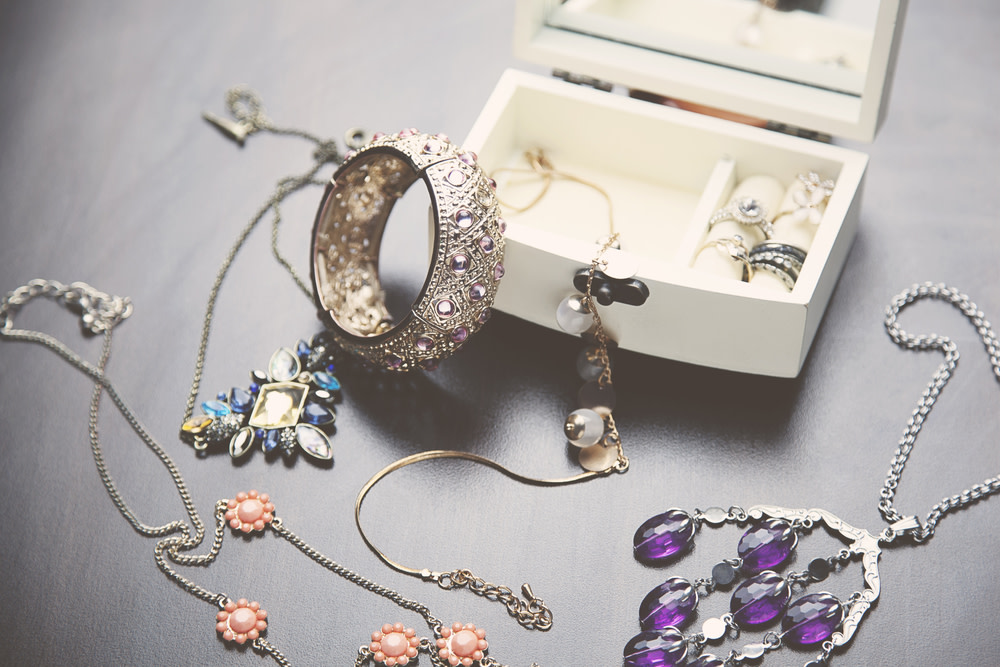
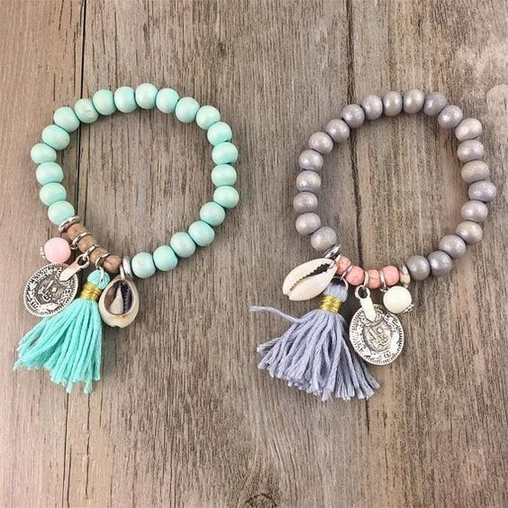

<html lang="pt-br">
	<head>
		<meta charset="utf-8"/>
	</head>
	<body style="background-color: lightblue;">
		

			

				<i>
					<strong>RGF Bijuterias</strong>
				</i>
			

		

		

			
			
			
		

		 
		

			
			
			
		

	</body>
</html>
